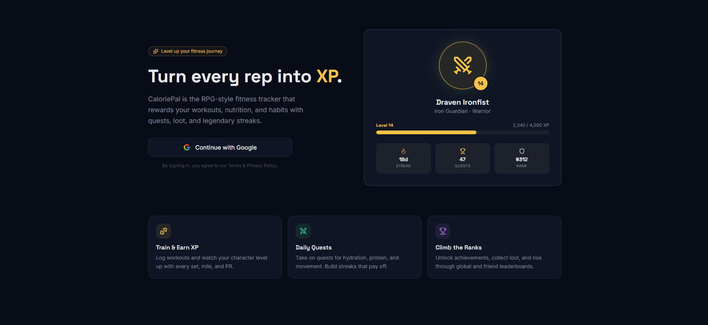

# CaloriePal

A fitness RPG web application that turns health tracking into a game. Users earn XP, level up, maintain streaks, complete daily quests, and spend coins in an in-app shop - all by logging real workouts and nutrition.

**Live:** [caloriepal-web.vercel.app](https://caloriepal-web.vercel.app)



---

## What it does

- **Quests** - Daily challenges across Training, Nutrition, and Mindset categories. Completing quests awards XP and coins.
- **Gamification** - XP-based leveling system with titles, player streaks, a longest-streak record, and a coin economy.
- **Nutrition tracking** - Log meals by searching a food database or entering macros manually. Daily calories, protein, carbs, and fat tracked against goals.
- **Workout logging** - Search exercises, log sessions with sets/reps/weight or duration/distance, track weekly goals and time trained.
- **Shop** - Spend coins on Streak Freezes to protect your streak on rest days.
- **Streak calendar** - 28-day visual history of activity, freeze count, current and longest streak.

---

## Tech stack

### Frontend

|            |                                             |
| ---------- | ------------------------------------------- |
| Framework  | Next.js 16 (App Router)                     |
| Language   | TypeScript                                  |
| Styling    | Tailwind CSS v4                             |
| Auth       | Supabase OAuth (Google) via `@supabase/ssr` |
| Icons      | Iconify, Lucide                             |
| Animations | Framer Motion                               |
| Deployment | Vercel                                      |

### Backend ([caloriepal-api](https://github.com/tonymocanu97/caloriepal-api))

---

## Project structure

```
src/
├── app/
│   ├── (main)/              # Protected layout (Sidebar + Topbar)
│   │   ├── dashboard/       # XP, quests, streak calendar, activity log
│   │   ├── quests/          # Quest board with category filters
│   │   ├── nutrition/       # Meal logging, macro tracking
│   │   ├── workouts/        # Workout sessions, exercise search
│   │   ├── shop/            # Coin shop (Streak Freeze)
│   │   └── settings/        # Profile management
│   ├── auth/
│   │   ├── callback/        # Supabase OAuth callback
│   │   └── logout/          # Sign out handler
│   └── api/auth/token/      # Server-side token endpoint
├── components/
│   ├── Sidebar/             # Navigation, logout
│   └── Topbar/              # Page title
├── models/                  # TypeScript DTOs
└── utils/
    ├── api.ts               # All API calls (token-cached, deduplicated)
    └── supabase/            # Client + server Supabase clients
```

---

## Local setup

### Prerequisites

- Node.js 18+
- A Supabase project with Google OAuth enabled
- The [backend API](https://github.com/tonymocanu97/caloriepal-api) running locally or pointed at Railway

### Environment variables

```env
NEXT_PUBLIC_SUPABASE_URL=https://your-project.supabase.co
NEXT_PUBLIC_SUPABASE_ANON_KEY=your-anon-key
NEXT_PUBLIC_API_URL=https://localhost:7066
```

### Run

```bash
npm install
npm run dev
```

Open [http://localhost:3000](http://localhost:3000).

---
